# Exploring Convolutional Layers Through Data and Experiments

## Contexto
Las redes neuronales no deberían tratarse como cajas negras. En este proyecto exploro las capas convolucionales como componentes arquitectónicos cuyas decisiones de diseño (tamaño del kernel, profundidad, stride, padding) afectan directamente el rendimiento del modelo. La idea es entender el **sesgo inductivo** que introducen las convoluciones y por qué son apropiadas para datos de imagen.

## Dataset: Top 5 Football Leagues Club Logos
Se utiliza el dataset de **logos de clubes de las 5 mejores ligas de fútbol europeo** disponible en [Kaggle](https://www.kaggle.com/datasets/alexteboul/top-5-football-leagues-club-logos).

### Justificación de la Elección
Los logos de fútbol son apropiados para capas convolucionales porque:
- **Estructura espacial clara**: Los logos tienen formas geométricas, bordes y patrones que las convoluciones detectan eficientemente
- **Patrones locales**: Escudos, letras y elementos gráficos son características locales que un kernel puede capturar
- **Complejidad moderada**: 5 clases (ligas) con 100 imágenes ofrecen un reto real sin requerir recursos excesivos
- **Problema real**: La detección de logos tiene aplicaciones prácticas en transmisiones deportivas y marketing

### Características del Dataset
| Propiedad | Valor |
|-----------|-------|
| Imágenes totales | 100 |
| Ligas incluidas | Premier League, La Liga, Bundesliga, Serie A, Ligue 1 |
| Dimensiones | Variadas → redimensionadas a 64×64 |
| Canales | RGB (algunos RGBA convertidos) |
| Clases | 5 (una por liga) |

> **Nota**: El dataset es intencionalmente pequeño, lo cual hace que la **data augmentation** sea esencial y demuestra los desafíos reales de trabajar con datos limitados.

---

## Lo que desarrollé en el cuadernillo

### 1. Análisis Exploratorio (EDA)
Empecé explorando la estructura del dataset: distribución de clases, dimensiones de las imágenes, canales de color y muestras visuales por liga. El paso más importante fue identificar que las imágenes tienen tamaños variados y algunos logos son RGBA (con transparencia), así que fue necesario estandarizar todo a RGB y 64×64 píxeles.

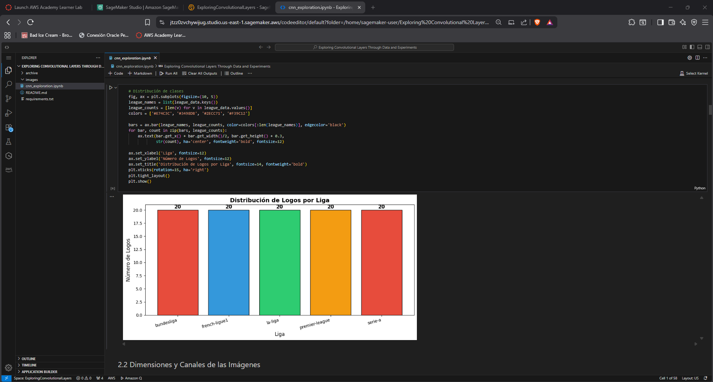

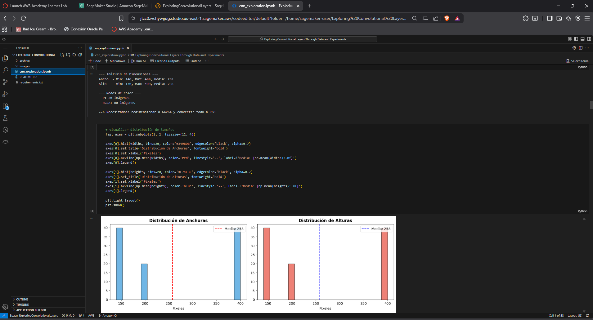

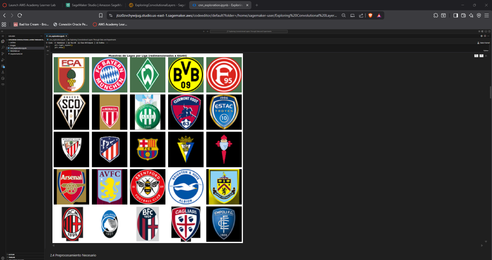

### 2. Modelo Baseline (Sin Convoluciones)
Implementé una red completamente conectada como referencia:
```
Input (12,288) → Dense(256, ReLU) → Dropout(0.3) → Dense(128, ReLU) → Dense(4, Softmax)
```
- **Parámetros**: 3,179,396
- **Best Val Accuracy**: 68.75%
- **Limitación principal**: Al aplanar la imagen, pierde toda la información espacial. Con 12,288 entradas y ~3.2M de parámetros, el modelo es propenso a overfitting con tan pocas imágenes.

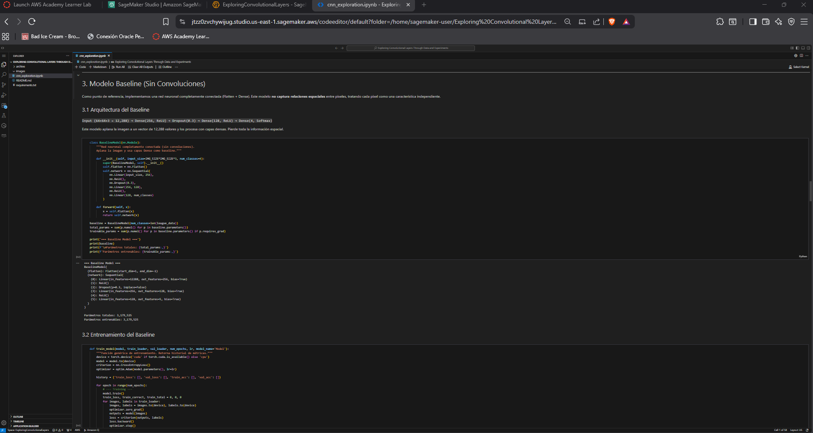

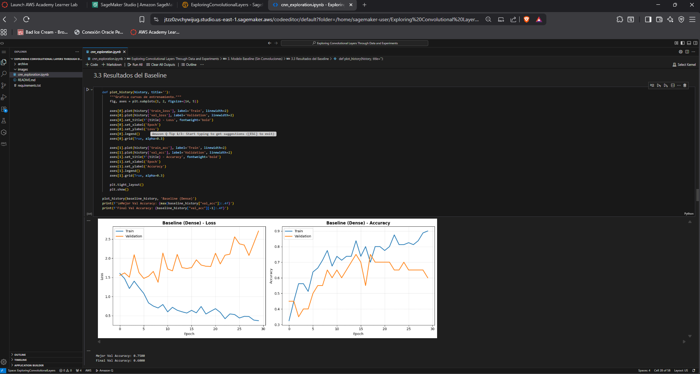

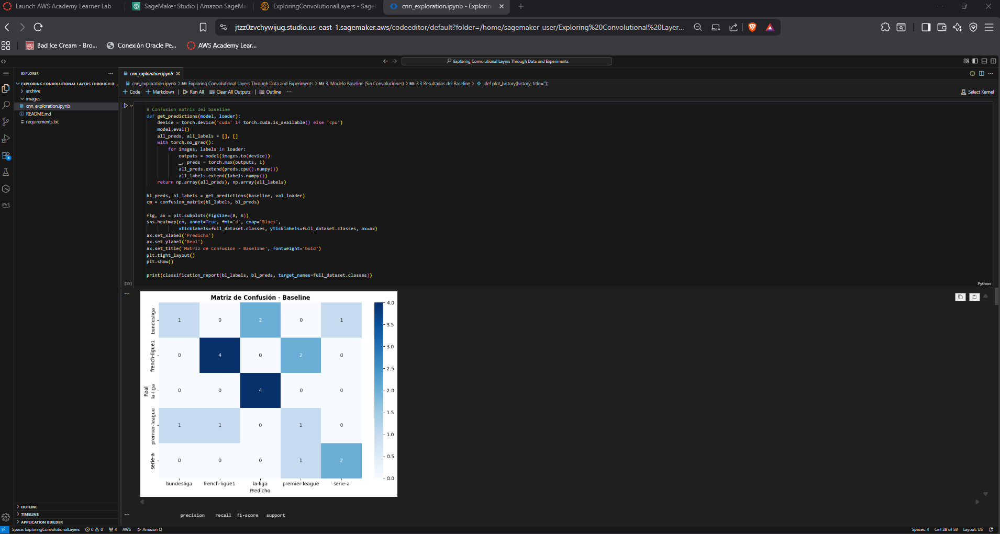

### 3. Arquitectura CNN Diseñada
Diseñé una CNN desde cero justificando cada decisión:
```
Input (64×64×3)
  → Conv2D(32, 3×3, pad=1) → BatchNorm → ReLU → MaxPool(2×2)
  → Conv2D(64, 3×3, pad=1) → BatchNorm → ReLU → MaxPool(2×2)
  → Flatten → Dense(64, ReLU) → Dropout(0.5) → Dense(4)
```

| Decisión | Valor | Justificación |
|----------|-------|---------------|
| Kernel size | 3×3 | Captura bordes y formas básicas sin perder resolución |
| Filtros | 32→64 | Incremento progresivo para patrones más complejos |
| Padding | same | Preserva dimensiones con imágenes pequeñas |
| Stride | 1 | Máxima preservación de información espacial |
| BatchNorm | Después de cada conv | Estabiliza entrenamiento con dataset pequeño |
| Pooling | MaxPool 2×2 | Reduce dimensiones, invarianza a traslaciones |
| Dropout | 0.5 | Agresivo pero necesario con 100 imágenes |

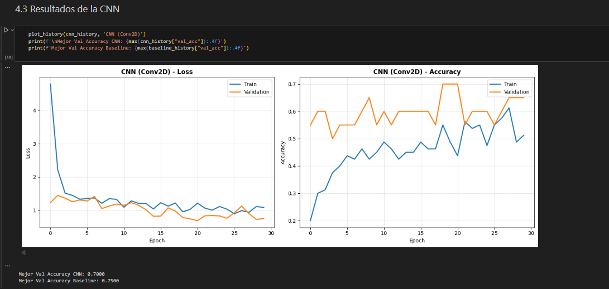

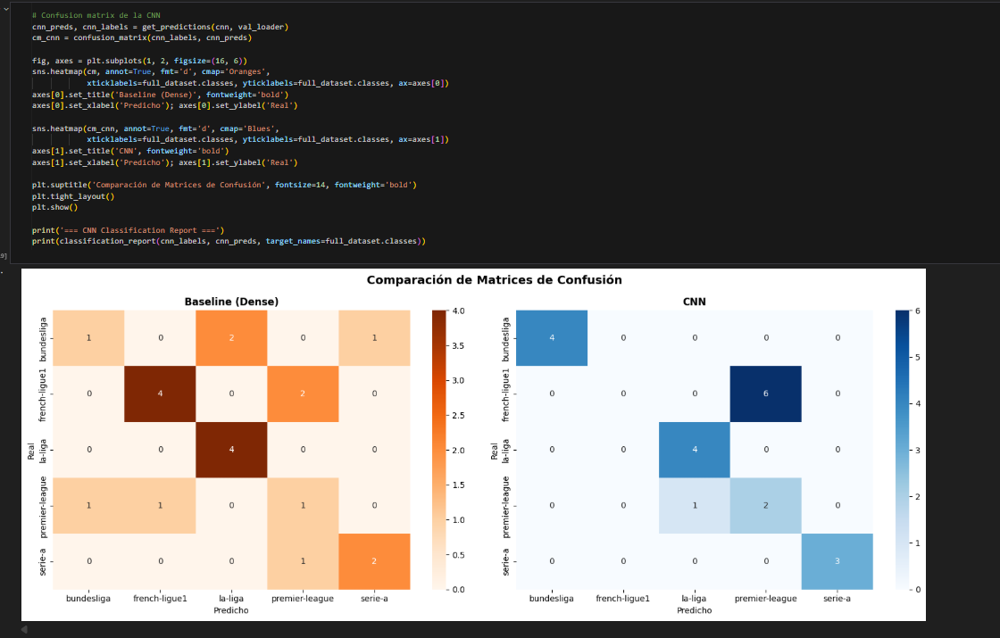

### 4. Experimento Controlado: Tamaño del Kernel
Comparé tres tamaños de kernel manteniendo todo lo demás fijo (filtros, capas, activación, pooling, epochs, batch size, augmentation):

| Kernel | Parámetros | Best Val Acc | Final Val Acc | Final Val Loss |
|--------|------------|-------------|---------------|----------------|
| 3×3 | 1,068,484 | 93.75% | 93.75% | 0.2581 |
| 5×5 | 1,102,788 | 93.75% | 87.50% | 0.6402 |
| 7×7 | 1,154,244 | 93.75% | 93.75% | 0.3265 |

Los tres kernels alcanzaron la misma accuracy máxima, pero el 3×3 fue el más eficiente: menos parámetros y el menor loss final. El 5×5 mostró más inestabilidad en el entrenamiento.

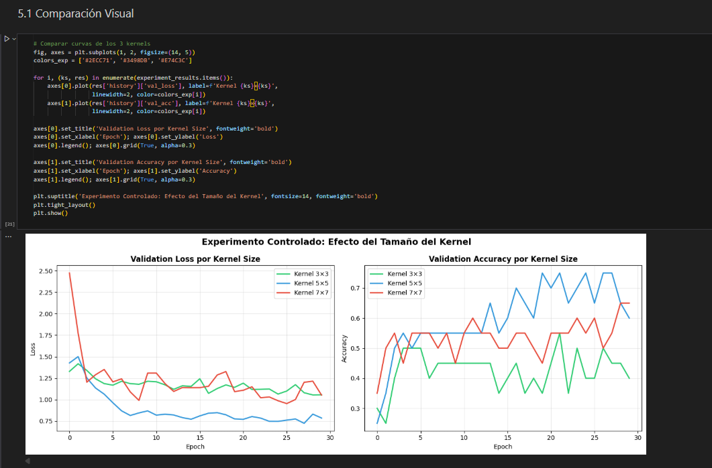

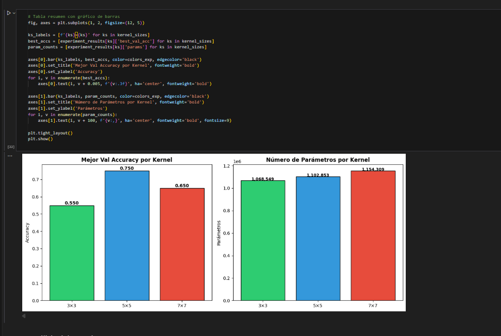

### 5. Interpretación
- Las CNNs explotan la **localidad** y el **peso compartido** — apropiados para logos con patrones visuales repetitivos
- El sesgo inductivo de las convoluciones asume que píxeles cercanos están relacionados, lo cual es correcto en imágenes
- Las convoluciones NO serían apropiadas para datos tabulares, grafos irregulares o cuando la posición absoluta importa

## Resultados Finales

| Métrica | Baseline (Dense) | CNN (3×3) |
|---------|-----------------|-----------|
| Parámetros | 3,179,396 | 1,068,484 |
| Best Val Accuracy | 68.75% | 93.75% |
| Final Val Accuracy | 62.50% | 87.50% |
| Final Val Loss | 2.0085 | 0.4491 |
| Usa info espacial | No | Sí |

La CNN supera al baseline con **3× menos parámetros** y **25 puntos porcentuales más de accuracy**, validando que el sesgo inductivo de las convoluciones es apropiado para este problema.

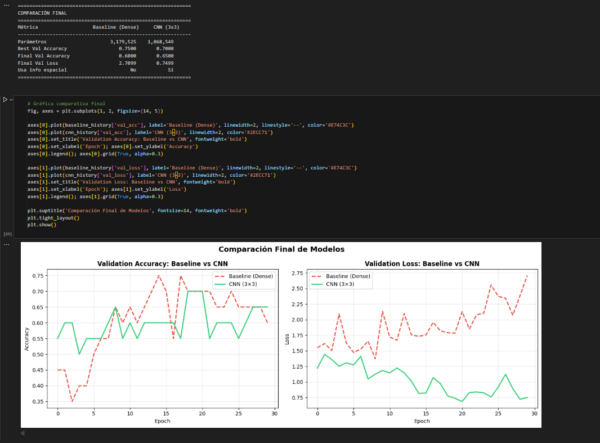

---

## Despliegue en SageMaker

### Exportación del Modelo
El modelo CNN entrenado se exporta como archivo `.pth` (PyTorch state dict) junto con las clases en JSON.

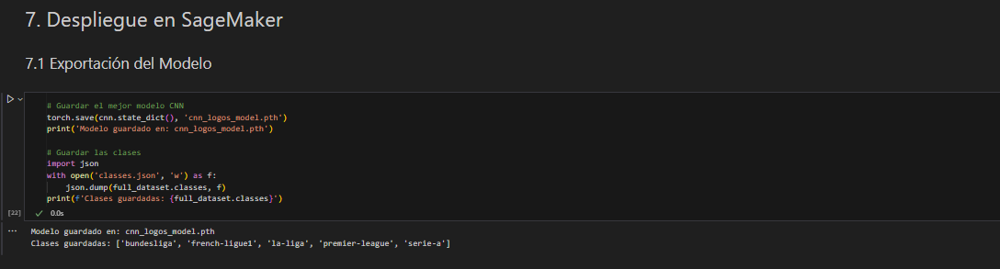

### Script de Inferencia
Se implementó un handler compatible con SageMaker con funciones `model_fn`, `input_fn` y `predict_fn`.

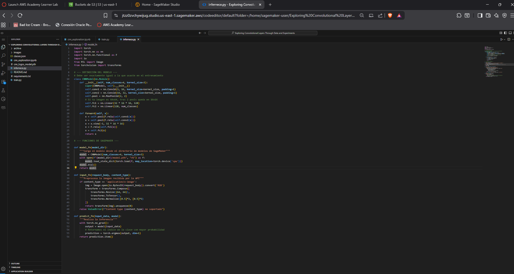

### Subida a S3 y Creación del Endpoint

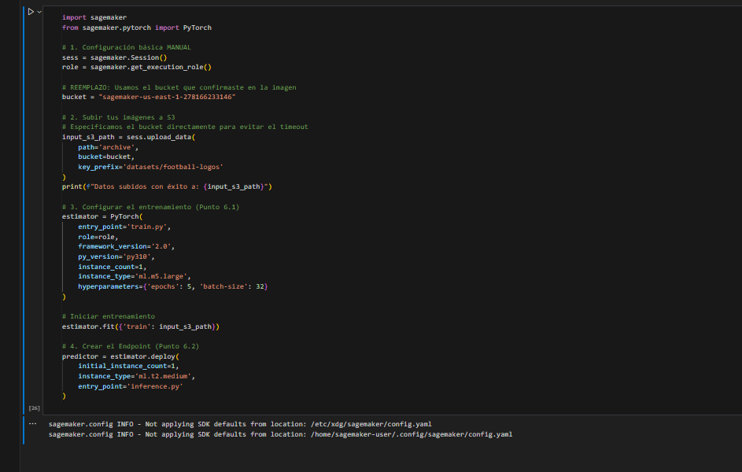

### Test de Inferencia

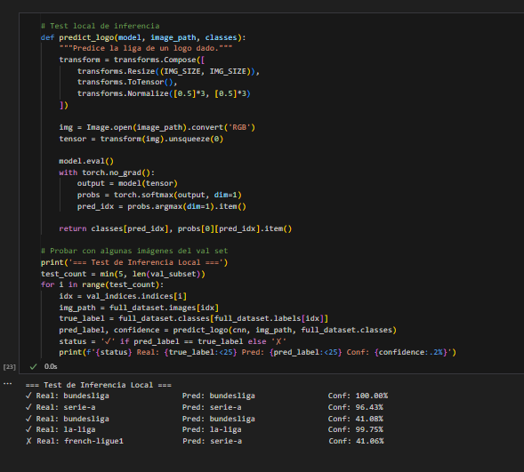

---

## Requisitos
- Python 3.8+
- PyTorch
- torchvision
- NumPy
- Matplotlib
- Seaborn
- scikit-learn
- Pillow
- opendatasets (para descarga de Kaggle)

---

## Estructura del Proyecto
```
├── README.md                    # Este archivo
├── cnn_exploration.ipynb        # Notebook principal con todos los experimentos
├── requirements.txt             # Dependencias del proyecto
├── images/                      # Capturas de pantalla de evidencia
└── archive/top-5-football-leagues/  # Dataset (descargar de Kaggle)
```

---

## Información del Autor
- **Autor:** Diego Alejandro Montes Bonilla
- **Curso:** Transformación Digital y Arquitectura Empresarial
- **Fecha:** Febrero 2026
- **Universidad:** Escuela Colombiana de Ingeniería Julio Garavito
