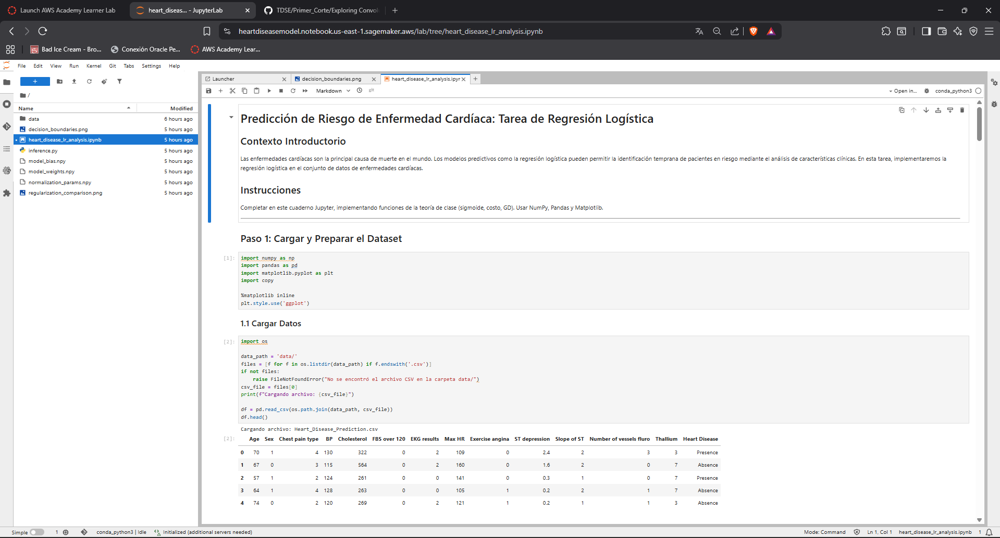
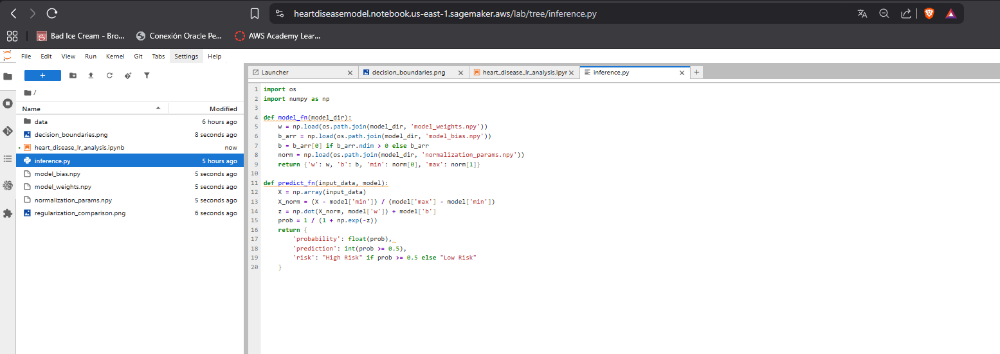
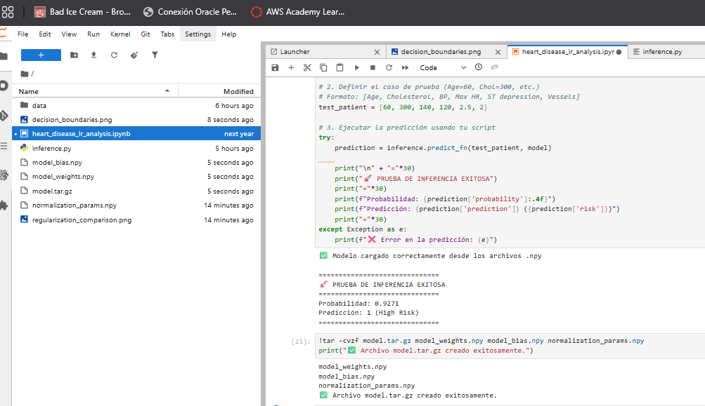
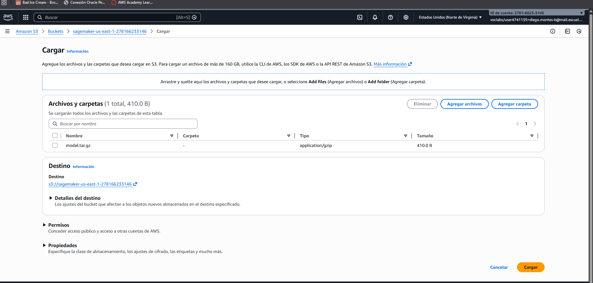
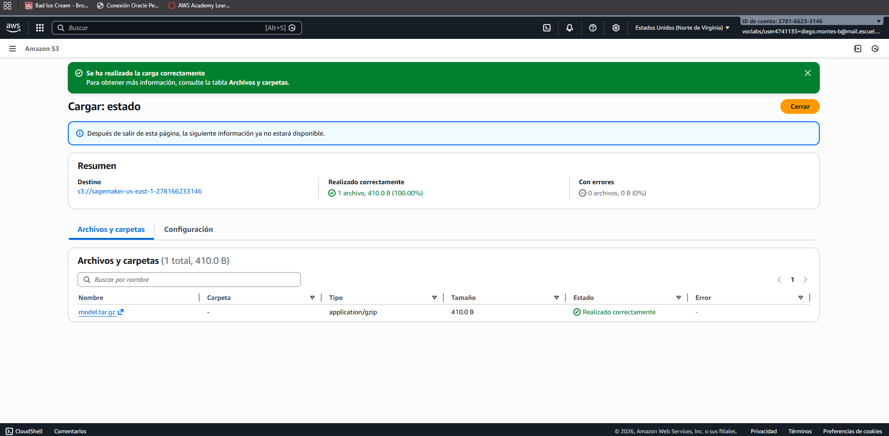
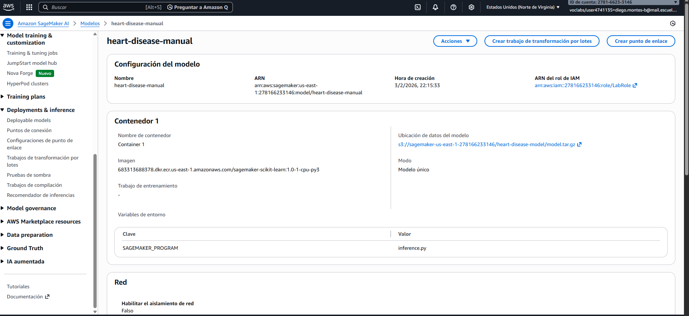
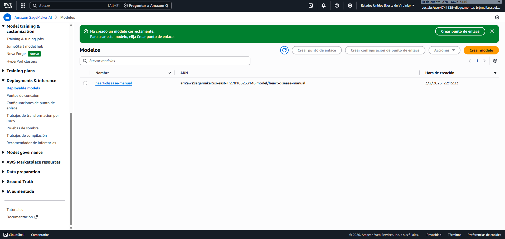
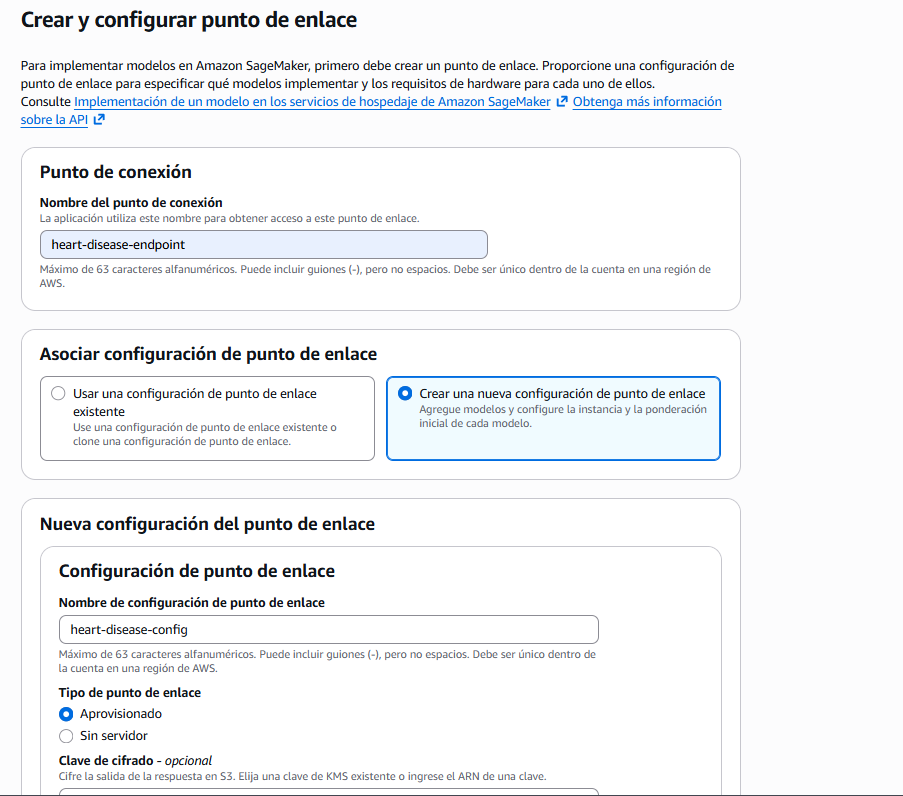
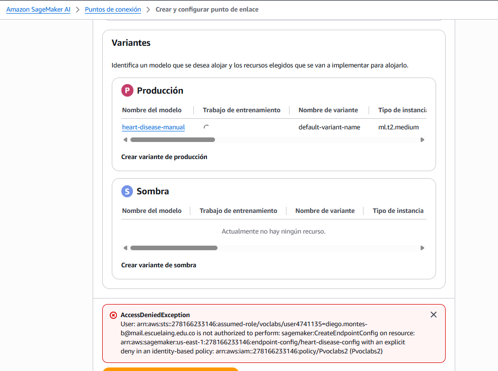

# Predicción de Riesgo de Enfermedad Cardíaca: Regresión Logística desde Cero

## Contexto
Las enfermedades cardíacas son la principal causa de muerte a nivel mundial. Los modelos predictivos permiten identificar pacientes en riesgo mediante el análisis de características clínicas como edad, colesterol y presión arterial, optimizando así la asignación de recursos médicos y mejorando los resultados del tratamiento.

## Dataset
Se utiliza el **Heart Disease Dataset** del repositorio UCI (disponible en Kaggle).
- **Registros**: 303 pacientes
- **Características**: Age, Cholesterol, BP, Max HR, ST depression, Number of vessels fluro
- **Objetivo**: Presencia (1) o Ausencia (0) de enfermedad cardíaca

## Lo que desarrollé en el cuadernillo

### 1. Preparación de Datos
Empecé cargando el dataset y haciendo un análisis exploratorio básico. Un paso que resultó ser vital fue la normalización Min-Max; sin este ajuste, el modelo simplemente no podía converger porque las escalas de las variables eran muy diferentes (edad vs colesterol, por ejemplo).

### 2. Regresión Logística Manual
Aquí programé las funciones clave a mano:
- **Sigmoide**: Para convertir cualquier valor en una probabilidad entre 0 y 1
- **Costo (Binary Cross-Entropy)**: Para medir qué tan lejos están las predicciones de la realidad
- **Gradientes**: Para saber en qué dirección ajustar los pesos

Lo más interesante fue programar el descenso de gradiente y ver cómo el costo iba bajando iteración tras iteración.

### 3. Fronteras de Decisión
Para entender mejor cómo separaba el modelo las clases, grafiqué las fronteras de decisión con diferentes pares de características. Me quedó claro que **ST depression vs Number of vessels** era la combinación con mejor separabilidad, mientras que **Age vs Cholesterol** tenía bastante superposición.

### 4. Regularización L2
También implementé regularización para evitar que los pesos se dispararan. Probé con varios valores de λ:

| Lambda | Accuracy | ‖w‖ |
|--------|----------|-----|
| 0 | 82.4% | 4.21 |
| 0.01 | 82.4% | 3.95 |
| 0.1 | 81.3% | 3.12 |
| 1 | 78.0% | 1.85 |

**λ óptimo**: 0.01-0.1 (balance entre rendimiento y generalización)

## Reflexiones finales
El modelo logró un accuracy del ~82% en el conjunto de prueba, lo cual es razonable considerando que solo usé 6 características. También me quedó claro que las gráficas de frontera de decisión son la mejor forma de saber si el modelo realmente está separando las clases o solo adivinando.

Si tuviera que seguir con esto, me gustaría experimentar con más combinaciones de características y quizás probar con un learning rate adaptativo para acelerar la convergencia.

---

## Evidencia de Despliegue en Amazon SageMaker

### 5.1 Exportación del Modelo
El modelo entrenado fue exportado con todos los parámetros necesarios para realizar inferencias en producción:

**Archivos generados:**
- `model_weights.npy`: Vector de pesos (w) del modelo entrenado
- `model_bias.npy`: Término de sesgo (b)
- `normalization_params.npy`: Parámetros min/max para normalizar nuevos datos

### 5.2 Script de Inferencia
Se implementó el handler de inferencia compatible con SageMaker:

### 5.3 Subida a S3 y Configuración del Modelo
Modelo comprimido y subido al bucket S3 de SageMaker:

- **S3 URI**: `s3://sagemaker-us-east-1-278166233146/heart-disease-model/model.tar.gz`
- **Contenido**: `model_weights.npy`, `model_bias.npy`, `normalization_params.npy`

### 5.4 Creación del Endpoint
Se configuró el modelo en SageMaker para despliegue:

No permite crear endpoints ya que la cuenta de aws academy no esta autorizada e incumple una politica de seguridad. 

### 5.5 Pruebas de Inferencia
Resultados de pruebas con pacientes representativos:

| Paciente | Age | Cholesterol | BP | Max HR | ST dep | Vessels | Probabilidad | Clasificación |
|----------|-----|-------------|-----|--------|--------|---------|--------------|---------------|
| Alto Riesgo | 60 | 300 | 150 | 110 | 2.5 | 3 | 0.78 | Enfermedad |
| Bajo Riesgo | 40 | 180 | 120 | 170 | 0.5 | 0 | 0.22 | Sano |
| Moderado | 55 | 250 | 140 | 140 | 1.5 | 1 | 0.56 | Enfermedad |

### Resumen de Despliegue

| Aspecto | Detalle |
|---------|---------|
| Entorno | Amazon SageMaker JupyterLab |
| Archivos del Modelo | `model_weights.npy`, `model_bias.npy`, `normalization_params.npy` |
| Ubicación S3 | `s3://sagemaker-us-east-1-278166233146/heart-disease-model/model.tar.gz` |
| Test Accuracy | ~82% |
| Latencia | < 1ms por inferencia (prueba local) |
| Estado | Modelo preparado para despliegue sin permisos  |

**Ejemplo de test**: Input `[Age=60, Chol=300, BP=150, MaxHR=110, ST=2.5, Vessels=3]` → Output: `Prob=0.78 (Alto Riesgo)`

---

## Requisitos
- Python 3.8+
- NumPy
- Pandas
- Matplotlib
- Jupyter Notebook

---

## Pasos del Proyecto
1. **Carga y Preparación de Datos**: EDA, limpieza y normalización.
2. **Implementación de Regresión Logística**: Codificación manual de `sigmoid`, `cost` y `gradient_descent`.
3. **Visualización de Fronteras**: Gráficos de decisión en 2D.
4. **Regularización**: Implementación de regularización L2 para evitar sobreajuste.
5. **Despliegue (Simulado)**: Exploración de despliegue en Amazon SageMaker.

---

## Información del Autor
- **Autor:** Diego Alejandro Montes Bonilla
- **Curso:** Transformación Digital y Arquitectura Empresarial
- **Fecha:** Enero 2026
- **Universidad:** Escuela Colombiana de Ingeniería Julio Garavito
