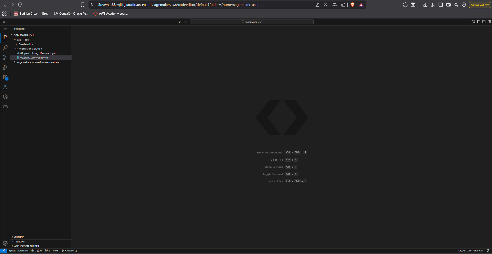
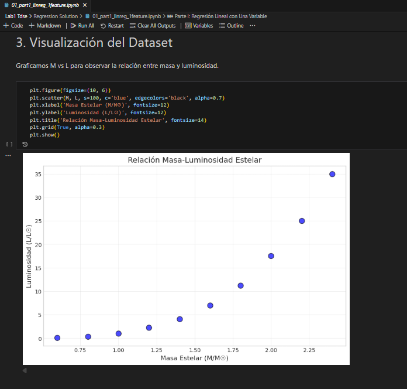
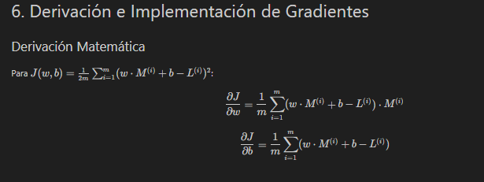
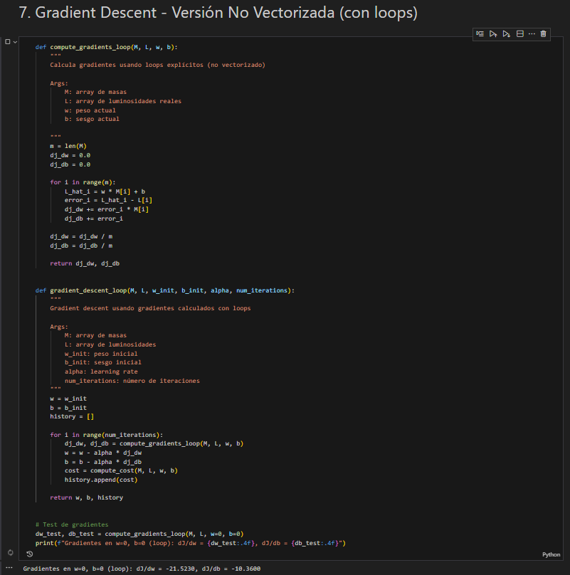
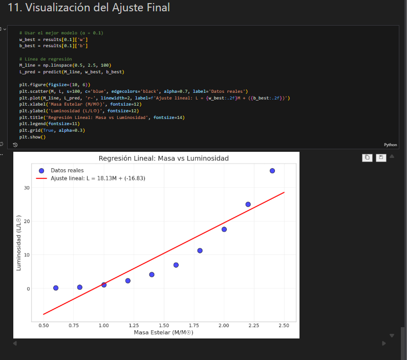
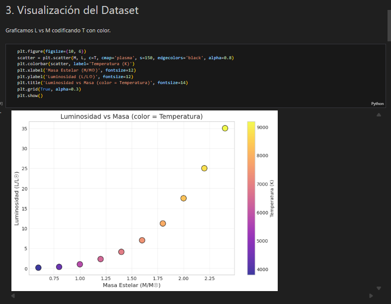
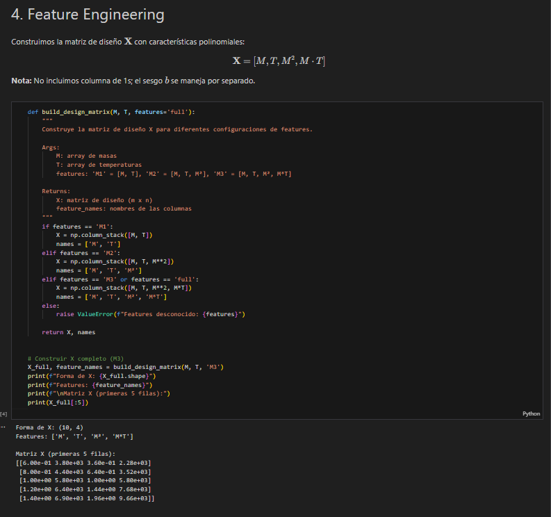
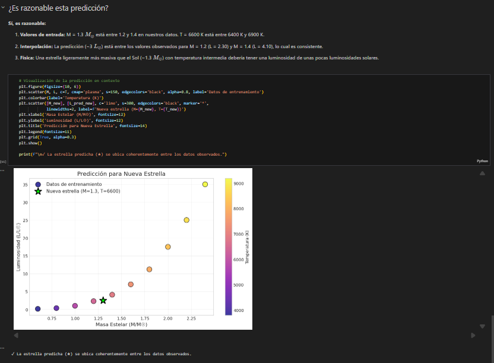

# Desarrollo de Modelos de Regresión para Luminosidad Estelar

Este proyecto nació de mi interés por entender qué pasa realmente "bajo el capó" de un modelo de aprendizaje automático. En lugar de usar herramientas que lo hacen todo automático, decidí trabajar con datos astrofísicos reales para predecir la luminosidad de las estrellas basándome en su masa y temperatura, pero haciendo los cálculos matemáticos desde cero. Usé NumPy para toda la parte lógica y Matplotlib para visualizar cómo el modelo iba mejorando.

---

## Lo que desarrollé en los cuadernillos

### 1. Regresión Lineal Simple
En el primer archivo, `01_part1_linreg_1feature.ipynb`, me enfoqué en la relación más directa: Masa vs. Luminosidad. Aquí programé el modelo lineal $L_{hat} = w \cdot M + b$ y calculé el error cuadrático medio. Lo más interesante fue programar los gradientes a mano; empecé con bucles simples y luego los pasé a una forma vectorizada para que el entrenamiento fuera mucho más veloz. También estuve probando diferentes valores de alpha para ver cuál ayudaba al modelo a converger sin dar saltos locos.

### 2. Regresión Polinomial con Interacción
Para el segundo cuadernillo, `02_part2_polyreg.ipynb`, quise ir más allá y probé con una regresión polinomial que incluyera la interacción entre masa y temperatura. Un paso que resultó ser vital fue el escalamiento de la temperatura (la dividí por 1000); sin este ajuste, los números eran tan grandes que el modelo simplemente no podía aprender. Al final, comparé tres versiones y el modelo M3, que es el más completo, fue el que mejor se ajustó a la realidad física de las estrellas.

---

## Requisitos técnicos

Para que el código funcione, solo hace falta tener instalado:
*   Python 3.x
*   NumPy (para la gestión de matrices)
*   Matplotlib (para generar las gráficas)

---

## Implementación y Pruebas en la Nube

Aunque trabajé la mayor parte del tiempo en mi entorno local, también llevé los cuadernillos a AWS SageMaker para validar que todo fuera reproducible en la nube.

### Pasos en SageMaker
Subir los archivos a SageMaker Studio fue bastante directo. Solo tuve que cargar los dos notebooks, elegir el kernel estándar de Python y darle a "Run All". El entorno ya incluía las librerías necesarias, así que no hubo que pelearse con instalaciones extra.

### Evidencias del trabajo en SageMaker

#### Parte 1: Regresión Lineal

Punto 1:

Punto 2:

Punto 3:

Punto 4:

Punto 5:

Punto 6:

Punto 7:

Punto 8:

Punto 9:

#### Parte 2: Regresión Polinomial

Punto 1:

Punto 2:

Punto 3:

Punto 4:

Punto 5:

Punto 6:

Punto 7:

---

## Mi análisis: Local vs. AWS

Al correr las mismas pruebas en mi PC y en la nube, noté un par de cosas. En local, la respuesta es casi instantánea, sobre todo con las gráficas interactivas que en VS Code cargan muy rápido. En SageMaker, el kernel a veces tarda unos segundos en arrancar o en procesar las operaciones más pesadas desde la web. Sin embargo, lo que realmente importa es que los pesos finales y el error del modelo fueron exactamente iguales en ambos sitios, lo que me da confianza en que el código es robusto.

---

## Reflexiones finales

El modelo mejoró muchísimo cuando dejé de usar solo la masa y empecé a jugar con términos cuadráticos y la temperatura. El error bajó de forma drástica. También me quedó claro que las gráficas de "Predicho vs. Real" son la mejor forma de saber si el modelo está funcionando o si solo está adivinando.

Si tuviera que seguir con esto, me gustaría automatizar la normalización de los datos con algo como el Z-score y añadir regularización L2 manual, para evitar que los pesos se disparen si decido aumentar todavía más la complejidad del polinomio.

---

## Información del Autor
*   **Autor:** Diego Alejandro Montes Bonilla
*   **Curso:** Transformación Digital y Arquitectura Empresarial
*   **Fecha:** Enero 2026
*   **Universidad:** Escuela Colombiana de Ingeniería Julio Garavito
